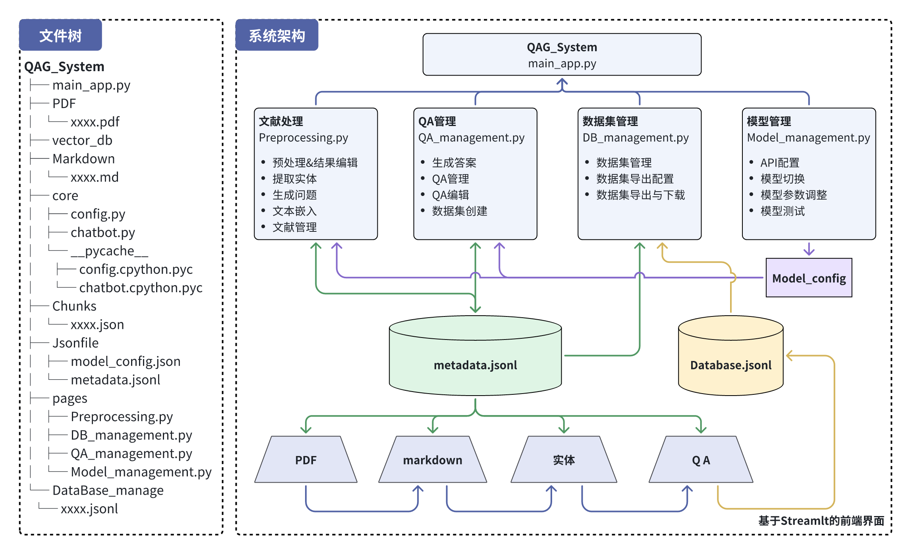
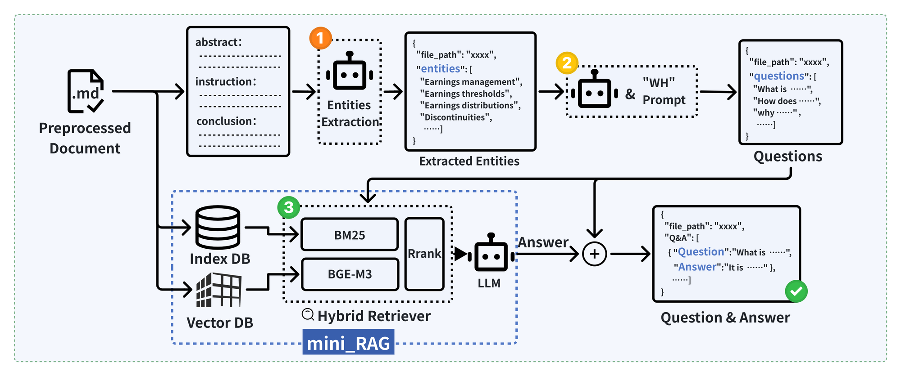
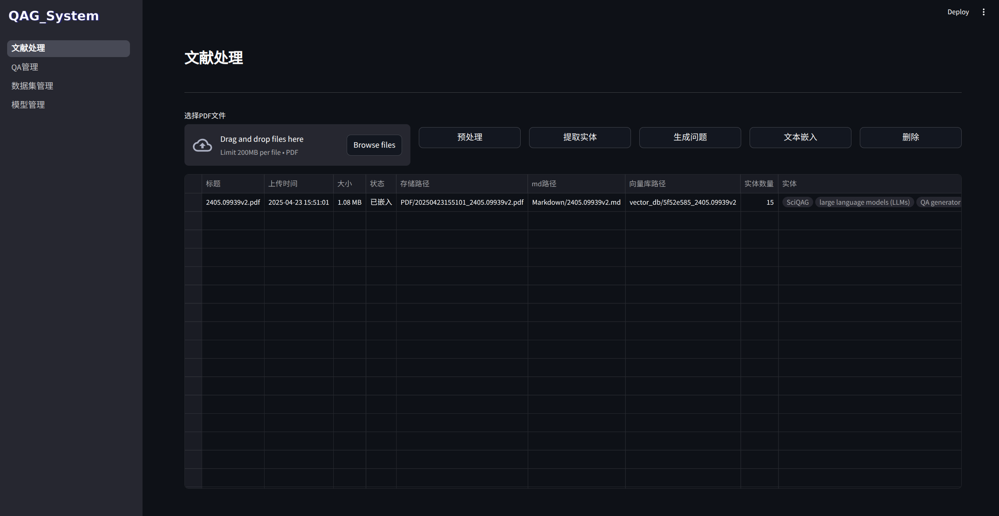
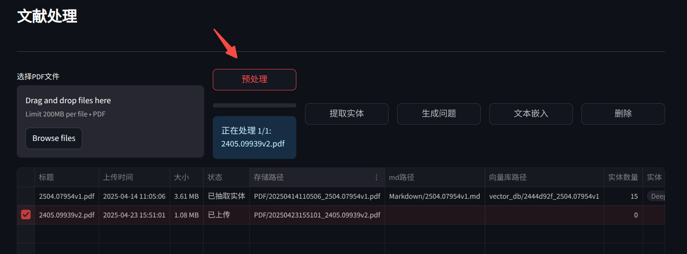
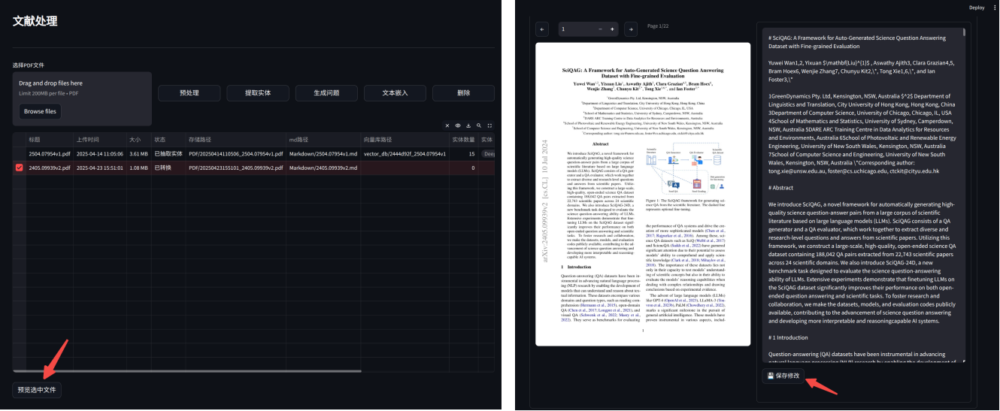
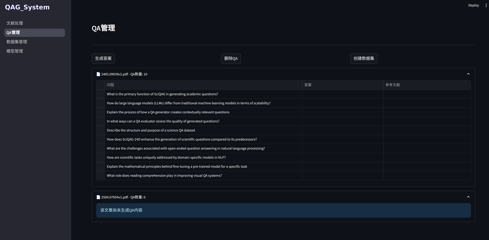
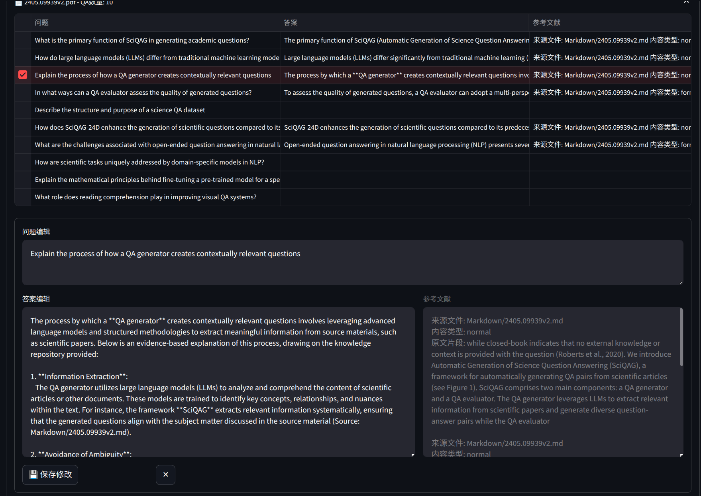
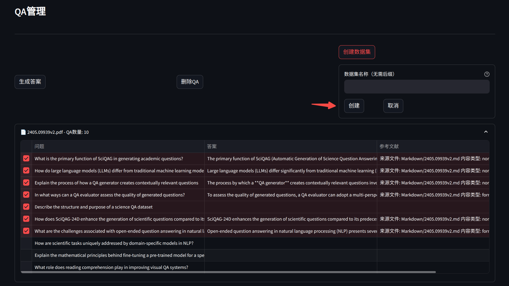
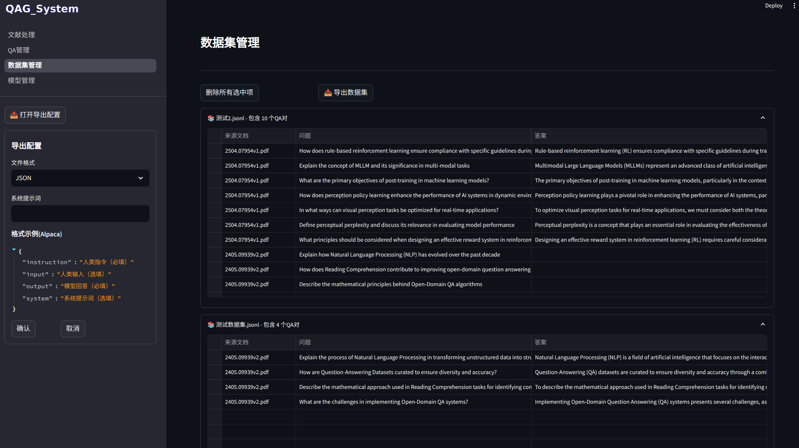
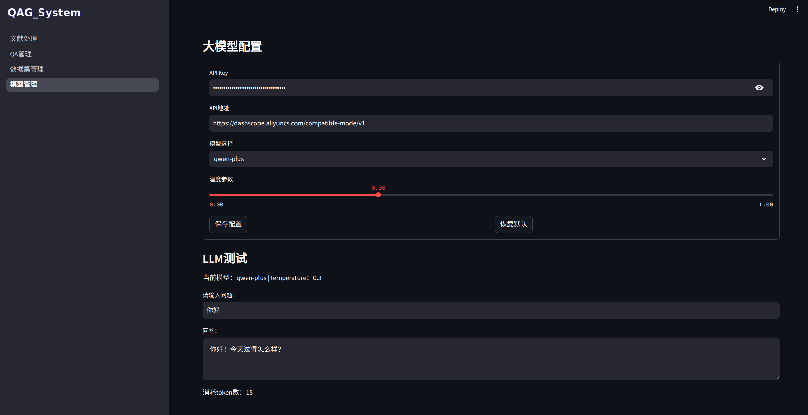

<div align="center">


**English** | [中文](README_CN.md)

</div>

# QAG_System

[QAG_System](https://github.com/Fakerfigure/QAG_System) is an automated Question-Answer dataset generation framework based on Retrieval-Augmented Generation (RAG) technology. It specializes in converting scientific papers into QA pairs, aiming to provide efficient, compliant, and high-quality data sources for Large Language Model (LLM) training.

## Table of Contents

- [Architecture](#architecture)
- [Core Technology - Mini_RAG](#core-technology---mini_rag)
- [Quick Start](#quick-start)
- [Page Guide](#page-guide)
- [Evaluation](#evaluation)

## Architecture



The system workflow from paper to QA consists of four key stages:

- **Document Processing**: File upload and parsing, preprocessing (PDF to Markdown), extraction of title, abstract, introduction, and conclusion. This stage also involves entity extraction and question generation using LLM.
- **QA Management**: Answer generation based on Mini_RAG, QA management and editing, and preliminary dataset creation.
- **Dataset Management**: Dataset management, editing, export, and download.
- **Model Management**: API configuration, model parameter adjustment, and model testing.

## Core Technology - Mini_RAG



This project creates a separate RAG system for each QAG task, ensuring system efficiency while facilitating management of different vector databases. The Mini_RAG workflow is as follows:

1. Extract key sections (abstract, introduction, conclusion) from documents (.md format)
2. Use LLM to extract entities and generate entity lists
3. Generate entity-related question sets using WH Prompt and LLM
4. In the retrieval stage, combine vector database with hybrid retriever (Mini_RAG), using BGE-M3 vector retrieval and BM25 keyword retrieval with hybrid strategy
5. Rank and retrieve questions to generate high-quality QA pairs

## Quick Start

⚠️ **Note**: This project requires GPU acceleration. Smooth operation requires at least **8GB** of VRAM!

### Clone Repository

```bash
git clone https://github.com/Fakerfigure/QAG_System.git
cd QAG_System
```

### Conda Virtual Environment (Optional)

```bash
conda create -n QAG_System python=3.10
conda activate QAG_System
```

### Install [MinerU](https://github.com/opendatalab/MinerU)

This project requires the [MinerU](https://github.com/opendatalab/MinerU) model.

```bash
pip install modelscope
wget https://gcore.jsdelivr.net/gh/opendatalab/MinerU@master/scripts/download_models.py -O download_models.py
python download_models.py
```

This project integrates MinerU for PDF-to-Markdown conversion. Please visit [MinerU](https://github.com/opendatalab/MinerU) to complete the installation first, ensuring it's in the same virtual environment.

### Install Dependencies

```bash
pip install -r requirements.txt
```

### Download Models

```bash
modelscope download --model BAAI/bge-m3 --local_dir ./dir
modelscope download --model BAAI/bge-reranker-large --local_dir ./dir
```

After downloading, manually add the model paths to `Jsonfile/em_model_config.json`. For example, if the path is `bin/QAG_System/modelscope/BAAI/bge-m3`:

```json
{
    "model_paths": {
        "embedding_model": "bin/QAG_System/modelscope/BAAI/bge-m3",
        "reranker_model": "bin/QAG_System/modelscope/BAAI/bge-reranker-large"
    }
}
```

### Launch

```bash
streamlit run QAG_System_app.py
```

After successful startup, if the browser doesn't open automatically, manually visit `http://localhost:8501`.

## Page Guide

### Page Structure

```
QAG_System/
├── pages/
│   ├── Preprocessing.py
│   ├── QA_management.py
│   ├── DB_management.py
│   └── Model_management.py
└── QAG_System_app.py
```

Based on Streamlit's frontend architecture requirements, all pages need to be registered in `QAG_System_app.py`, which handles system initialization, page invocation, and navigation configuration. Other pages are managed in the `pages` directory.

### Document Processing Page

The Document Processing page handles file upload and parsing, preprocessing (PDF to Markdown), extraction of title, abstract, introduction, and conclusion. It also uses LLM for entity extraction and question generation.



**File Upload**

Users can click or drag to upload paper files (PDF format only). The system creates metadata for each file. For example, when `2405.09939v2.pdf` is uploaded:

```json
{
    "title": "2405.09939v2.pdf",
    "upload_time": "2025-04-23 15:51:01",
    "size": "1.08 MB",
    "status": "uploaded",
    "storage_path": "PDF/20250423155101_2405.09939v2.pdf",
    "md_path": "",
    "vector_db_path": "",
    "entity_count": 0,
    "entities": [],
    "chunks_path": "",
    "QA_result": []
}
```

**Preprocessing**

After selecting one or more files, click the "Preprocess" button to convert selected files to Markdown format.



**Markdown Preview & Edit**

Preprocessed documents support Markdown viewing and editing. Select a file and click "Preview Selected File" to enter the preview interface.



**Entity Extraction**

Select preprocessed files and click "Extract Entities" to generate entities. The system extracts abstract, introduction, and conclusion sections, then uses LLM for entity extraction.

**Question Generation**

Select documents with extracted entities and click "Generate Questions". The system generates 10 scientific questions around the entities.

**Text Embedding**

Select converted documents and click "Text Embedding". The system splits Markdown documents and converts them to vectors stored locally.

### QA Management Page

This stage completes answer generation based on Mini_RAG, QA management and editing, and preliminary dataset creation.



**Generate Answers**

Select questions to generate answers and click "Generate Answers". The system calls the Mini_RAG framework to generate answers.

**QA Editing**

Select a QA pair to edit. Users can freely adjust questions and answers (except references).



**Create Dataset**

Select QAs to create a dataset, click "Create Dataset", enter a dataset name, and the system will extract selected QAs to generate a dataset file.



### Dataset Management Page

This page handles dataset management, editing, export, and download.



### Model Management Page

The Model Management page provides global management of LLMs used in the project.



The system only supports OpenAI-compatible interfaces. Users can configure API key, model URL, temperature, and other parameters.

## Evaluation

The system includes 5 evaluation dimensions: Relevance, Unawareness, Completeness, Accuracy, and Rationality.

See [eval/readme.md](eval/readme.md) for detailed evaluation results and prompts.


