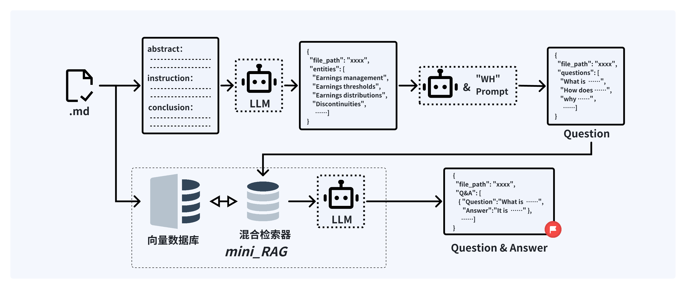

   

[QAG_System](https://github.com/Fakerfigure/QAG_System)是一个基于检索增强生成(RAG)技术的自动化问答数据集生成框架，专注于将科学论文转换成QA对，旨在为大型语言模型(LLM)训练提供高效、合规的高质量数据源。  

### 项目架构


整个系统的功能框架和文件结如上图所示，我们将论文到QA的工作过程分为三个关键环节：

- 文献处理：该环节主要完成文件的上传与解析，对文件进行预处理例如PDF转markdown、提取标题、摘要、介绍、结论等，并将处理后的文件存储到指定目录，此外该环节需要利用大模型提取实体并产生问题。  
- QA管理：该环节主要完成基于Mini_RAG的答案生成,QA管理与编辑，以及完成初步的数据集创建。
- 数据集管理：该环节主要完成数据集的管理与编辑，数据集的导出与下载。
- 模型管理：该环节主要完成模型的API配置，模型参数调整以及模型测试。

### 核心技术-Mini_RAG

  

本项目为每个QAG任务创建了单独的RAG系统，可以在保证系统高效的同时便于管理不同的向量库，Mini_RAG具体的工作流程如下：  
首先，从文档（.md 格式）中提取摘要、指令和结论等关键部分，并通过 LLM 抽取实体，生成实体列表。接着，利用 WH Prompt 和 LLM 生成与实体相关的问题集合。在检索阶段，结合向量数据库和混合检索器（mini_RAG），使用 BGE-M3 向量检索和 BM25 关键词检索的混合策略，对问题进行检索并排序，最终生成高质量的问答对。

### 快速开始

⚠️ 注意：本项目依赖GPU加速，流畅运行本项目至少需要**8G**显存！！

#### 拉取代码

```bash
    git clone https://github.com/Fakerfigure/QAG_System.git
    cd QAG_System
```

#### Conda虚拟环境（可选）

```bash
    conda create -n QAG_System python=3.10
    codna activate QAG_System 
```

#### [MinerU](https://github.com/opendatalab/MinerU)安装

本项目在预处理的PDF转Markdown环境整合MinerU,因此请移步[MinerU](https://github.com/opendatalab/MinerU)， 先完成MinierU的安装,切记在同一个虚拟环境下。

#### 安装依赖

```bash
    pip install -r requirements.txt
```

#### 模型下载

```bash
    modelscope download --model BAAI/bge-m3 --local_dir ./dir
    modelscope download --model BAAI/bge-reranker-large --local_dir ./dir
```

下载好模型后，需要手动将模型文件添加在 `Jsonfile/em_model_config.json` 中，假设路径为`bin/QAG_System/modelscope/BAAI/bge-m3`,则文件修改为：

```json
    {
        "model_paths": {
        "embedding_model": "bin/QAG_System/modelscope/BAAI/bge-m3",
        "reranker_model": "bin/QAG_System/modelscope/BAAI/bge-reranker-large"
        }
    }
```

#### 启动  

```python
    streamlit run QAG_System_app.py
```

启动成功后，若浏览器没有自动弹出，则手动访问`http://localhost:8501`。

### 页面介绍

#### 页面结构

```bash
    QAG_System/
    ├── pages/
    │   ├── Preprocessing.py
    │   ├── QA_management.py
    │   ├── DB_management.py
    │   └── Model_management.py
    └── QAG_System_app.py
```

基于streamlit的前端架构要求，所有页面都需要在`QAG_System_app.py`中进行注册，`QAG_System_app.py`中主要完成了系统的初始化和页面的调用以及导航栏的配置，其他页面都在`pages`目录下统一管理，每一个页面都是一个单独的`python`文件，页面的功能和设计都在各自的文件中进行编写。

#### 文献处理页

文献处理页主要包含文件的上传与解析，对文件进行预处理例如PDF转markdown、提取标题、摘要、介绍、结论等，并将处理后的文件存储到指定目录，此外该环节需要利用大模型提取实体并产生问题，其界面如图所示，文件成功上传后，`st.dataframe`会读取元数据的内容并呈现在表格中，表格支持多行选中操作。


- 文件上传
  用户可以点击或拖动上传论文文件（限定PDF格式），系统会为该文件创建元数据，以2405.09939v2.pdf文件为例，当其正确上传后其元数据为：

```json
    {
        "标题": "2405.09939v2.pdf", 
        "上传时间": "2025-04-23 15:51:01", 
        "大小": "1.08 MB", "状态": "已上传", 
        "存储路径": "PDF/20250423155101_2405.09939v2.pdf", 
        "md路径": "", 
        "向量库路径": "", 
        "实体数量": 0, 
        "实体": [], 
        "Chunks地址": "", 
        "QA_result": []
    }
```

- 预处理

当用户选定一行或多行文件后（无选中数据会出发警告），点击“预处理”按钮，系统会自动将选定的文件转换为markdown格式，将markdwon存储在制定目录下，并更新元数据信息，如下图所示。


转换成功后，更新“状态”为“已转换”，更新“md路径”为转换后的markdown文件存储路径，元数据如下：

```json
    {
        "标题": "2405.09939v2.pdf", 
        "上传时间": "2025-04-23 15:51:01", 
        "大小": "1.08 MB", 
        "状态": "已转换", 
        "存储路径": "PDF/20250423155101_2405.09939v2.pdf", 
        "md路径": "Markdown/2405.09939v2.md", 
        "向量库路径": "", 
        "实体数量": 0,
        "实体": [],
        "QA_result": [], 
        "Chunks地址": ""
    }
```

- Markdown预览与修改：

经过预处理的文档支持查看markdown，并修改markdown,选中需要查看的数据（仅支持单条），在列表下方会出现“预览选中文件”，点击进入预览界面，可以对照PDF源文件查看并修改markdown，修改完成后点击“保存修改”，系统会自动将修改后的markdown文件存储到指定目录下,如下图所示。


- 提取实体：

选择经过预处理的文件可以通过点击“提取实体”按钮来生成实体，首先系统会利用正则的方式提取md文件中abstract、instructions、conclusion等部分，然后利用大模型进行实体抽取，将实体存储在元数据中，该过程可以批量进行。

抽取实体后，更新“实体数量”为抽取出的实体数量，更新“实体”为抽取出的实体列表，此外用户也可以在列表中预览实体，默认抽取实体数量为15，元数据如下：

```json
    {
        "标题": "2405.09939v2.pdf", 
        "上传时间": "2025-04-23 15:51:01", 
        "大小": "1.08 MB", 
        "状态": "已抽取实体", 
        "存储路径": "PDF/20250423155101_2405.09939v2.pdf", 
        "md路径": "Markdown/2405.09939v2.md", 
        "向量库路径": "", 
        "实体数量": 15, 
        "实体": [
            "SciQAG", 
            "large language models (LLMs)", 
            "QA generator", 
            "QA evaluator",  
            ... ，
            "Med-PALM", 
            "Galactica"
        ], 
        "QA_result": [], 
        "Chunks地址": ""
    }
```

- 生成问题

选中完成抽取实体文档可以进行问题生成，点击“问题生成”按钮，系统将会利用大模型生成10个围绕“实体”的科学问题，并将其存储在元数据中，生成问题后，状态会更新为“已生成问题”，问题会以列表的形式存放在“QA_result”值中，元数据（有省略）如下：

```json
    {
        "标题": "2405.09939v2.pdf",
        "上传时间": "2025-04-23 15:51:01",
        "大小": "1.08 MB",
        "状态": "已生问题",
        "存储路径": "PDF/20250423155101_2405.09939v2.pdf",
        "md路径": "Markdown/2405.09939v2.md",
        "向量库路径": "",
        "实体数量": 15,
        "实体": [
            "SciQAG",
            "large language models (LLMs)",
            ...,
            "Galactica"
        ],
        "QA_result": [
            {
            "question": "Describe the structure ... QA dataset",
            "answer": "",
            "reference": ""
            }
        ]...,
        "Chunks地址": ""
    }
```


- 文本嵌入

选择经过转换的文档，点击“文本嵌入”按钮，系统会将markddown文档进行切分并转换成向量存储在本地，每个文档生成自己独立的向量库。完成文本嵌入后，状态会更新为“已嵌入”，向量库路径会更新为向量库的存储路径，所有的向量会独立存放在本地vector_db文件夹内，并根据论文文件名的哈希值进行命名。

- 文献删除

选中需要删除的文件，点击“删除”按钮，系统会删除掉该文件对应的元数据，并删除该文件对应的markdown文件，向量库文件，以及该文件对应的pdf文件，该过程不可逆，且会影响到QA管理页的内容。

#### QA管理页

该环节主要完成基于Mini_RAG的答案生成,QA管理与编辑，以及完成初步的数据集创建，当在文献处理页完成“生成问题”和“文本嵌入”后，QA管理页如下图所示。


在QA管理页中，每篇文献会独立生成一个QA管理子页面（单独列表），未生成QA的论文会提示“尚未生QA”。

- 生成答案

选中需要生成答案的问题，点击“生成答案”按钮，系统会调取后台Mini_RAG框架来生成答案。
完成答案生成后，系统会将答案和参考更新在元数据中，列表会触发读取机制，将更新后的QA数据呈现在页面中，由于RAG检索召回环节和答案生成为两个过程，因此，即使LLM因为一些原因输出有误，用户还可以通过查看参考文献自行填写答案。

- QA编辑

选中需要编辑的一组QA,在该论文列表下方会出现“双击编辑选中QA”按钮，双击后会进入QA编辑页，在该子页中，用户可以自由调整除参考文献以外的问题和答案，如下图所示。


- QA删除

选中需要删除的QA,点击“删除”按钮，系统会删除该QA（问题、答案、参考文献）并更新元数据。

- 创建数据集

选择需要创建数据集的QA，点击“创建数据集”按钮，系统会弹出创建数据集的窗口，用户可以输入数据集名称，并点击“创建”按钮，系统会将选中QA（不含参考文献）从元数据中提取出来，在本地DataBase_manage目录下生成数据集文件，创建过程如下图所示。


### 数据集管理页

该页面主要完成数据集的管理与编辑，数据集的导出与下载，其页面如下图所示。


在数据集管理页中，系统会自动读取在DataBase_manage目录下的数据集文件，每个数据集单独形成列表，用户通过列表管理数据集，在侧边栏可以配置数据集的导出细则，导出文件支持json，jsonl，csv，配置完成导出细则后，右边“导出数据集”按钮会变成“下载数据集”按钮。

### 模型管理页

QAG_System每个页面或多或少都使用到了LLM，而LLM通常调取API进行使用，配置一个适合自身项目的大模型需要仔细配置API,并通过充分的测试，为了用户方便配置和测试模型，本系统提供一个模型管理页来对项目使用的LLM进行全局管理，其页面如下。


本系统仅支持类OpenAI式接口，用户可以根据自己的需求自行配置接口参数如密钥、模型url、模型
温度系数等参数，配置完成后点击“保存配置”，系统会将参数存储为结构化数据，我们为系统定制了统一的chatbot库，各页面通过调用该库来读取模型配置，完成全局模型统一，此外，配置好的模型可以在下方进行LLM测试，测试栏会实时返回模型输出和消耗的token数量并标注当前模型以及相关参数，方便用户进行模型调试。

### Citation

```bibtex
@misc{wang2024mineruopensourcesolutionprecise,
      title={MinerU: An Open-Source Solution for Precise Document Content Extraction}, 
      author={Bin Wang and Chao Xu and Xiaomeng Zhao and Linke Ouyang and Fan Wu and Zhiyuan Zhao and Rui Xu and Kaiwen Liu and Yuan Qu and Fukai Shang and Bo Zhang and Liqun Wei and Zhihao Sui and Wei Li and Botian Shi and Yu Qiao and Dahua Lin and Conghui He},
      year={2024},
      eprint={2409.18839},
      archivePrefix={arXiv},
      primaryClass={cs.CV},
      url={https://arxiv.org/abs/2409.18839}, 
}
@misc{wan2024sciqagframeworkautogeneratedscience,
      title={SciQAG: A Framework for Auto-Generated Science Question Answering Dataset with Fine-grained Evaluation}, 
      author={Yuwei Wan and Yixuan Liu and Aswathy Ajith and Clara Grazian and Bram Hoex and Wenjie Zhang and Chunyu Kit and Tong Xie and Ian Foster},
      year={2024},
      eprint={2405.09939},
      archivePrefix={arXiv},
      primaryClass={cs.CL},
      url={https://arxiv.org/abs/2405.09939}, 
}
```
